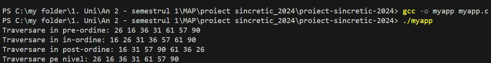

# Traversarea arborilor binari ordonați 

## Introducere

Proiectul de față prezintă arborii binari ordonați printr-o implementare în limbajul de programare C. Un arbore binar ordonat este o structură de date în care fiecare nod are cel mult doi copii, iar valorile nodurilor respectă următoarea ordine:
- ***subarborele stâng*** conține doar noduri cu valori ***mai mici*** decât valoare nodului curent
- ***subarborele drept*** conține doar noduri cu valori ***mai mari*** decât valoarea nodului curent

## Detalii Despre Implementare

Proiectul implementează un arbore binar ordonat în câțiva pași:
- inserează 8 noduri în mod aleatoriu într-un arbore binar ordonat
- traversează arborele creat în patru moduri distincte:
1. *In-ordine*(in-order traversal): vizitează subarborele stâng, apoi rădăcina și subarborele drept, oferind o secvență ordonată

2. *Pre-ordine*(pre-order traversal): vizitează radăcina mai întâi, apoi subarborele stâng și drept

3. *Post-ordine*(post-order traversal): vizitează subarborele stâng și drept înainte de a vizita rădăcina

4. *Pe nivel*(level-order traversal): vizitează nodurile nivel cu nivel, începând cu rădăcina

## Platforma Software Utilizată

Următoarele platforme au fost utilizate pentru dezvoltarea acestui proiect, implementat în limbajul de programare C:
- Sistemul de operare: ***Windows***
- IDE (Integrated Development Environment): ***Visual Studio Code***
- Compilatorul: ***GCC*** (GNU Compiler Collection)

## Modalități De Rulare

1. Pentru a rula acest program, asigură-te că ai următoarele instalate:

- **Visual Studio Code**
    - Instalare: [Apasa aici pentru instalare VSC](https://code.visualstudio.com/download).
- **Extensia C/C++**
    - Instalare: [Apasa aici pentru instalare C/C++](https://marketplace.visualstudio.com/items?itemName=ms-vscode.cpptools)
     
- **Compilator GCC**:
    - Instalare pe Linux: `sudo apt install gcc`
    - Instalare pe Windows: [Apasa aici pentru instalare MinGW](https://sourceforge.net/projects/mingw/).
- Sistem de operare compatibil: Windows, Linux sau macOS.

2. Descarcă proiectul

Deschide folderul proiectului în Visual Studio Code.

**Rulare Locală**

- Deschide fișierul `myapp.c`:
- Compilează programul folosind GCC:
  
   `gcc -o myapp myapp.c`

- Execută programul compilat:
   
   `./myapp`

## Rezultate
La rularea proiectului se inserează 8 noduri în mod aleatoriu într-un arbore binar ordonat și se afișează traversarile prezentate mai sus. 

